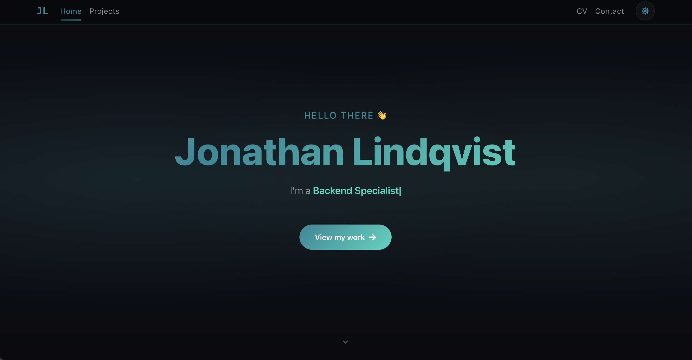

# JLindqvist — Personal Portfolio & CV

My personal portfolio website showcasing my work experience, projects, and skills as a software engineer.

**Live site:** *Coming soon*


---

## Preview



---

## Why I Built This

I wanted a single place to present myself professionally — not just a static PDF, but a living site where I can show who I am, what I've worked on, and how to reach me. It also serves as a playground for trying out things like theming, scroll animations, and responsive layouts.

---

## Features

- **Dark / Light mode** — toggle with persistence via `localStorage`
- **Animated sections** — scroll-triggered fade-up animations with Framer Motion
- **Interactive CV** — detailed work experience, education, skills, and certifications
- **Project showcase** — cards with tech tags and links to GitHub repos
- **Contact form** — powered by EmailJS (no backend needed)
- **Responsive design** — works on desktop, tablet, and mobile

## Tech Stack

| Category | Technologies |
|---|---|
| **Framework** | React 18 |
| **Routing** | React Router v6 |
| **UI** | React Bootstrap, React Icons |
| **Animations** | Framer Motion, React Typical |
| **Styling** | CSS custom properties (theming), glassmorphism |
| **Contact** | EmailJS |

## Project Structure

```
src/
├── App.js                  # Root component with routing
├── App.css                 # All styles + dark/light theme variables
├── index.js                # Entry point
├── context/
│   └── ThemeContext.js      # Dark/light mode state (React Context)
├── components/
│   ├── NavbarComponent.js   # Navigation bar with theme toggle
│   └── Footer.js            # Footer with social links
├── Pages/
│   ├── HomePage.js          # Hero, about section, project cards
│   ├── CvPage.js            # Full CV (experience, education, skills)
│   ├── ContactPage.js       # Contact form (EmailJS)
│   └── SliderZyn.js         # Image carousel component
└── images/                  # Photos and project screenshots
```

## Getting Started

```bash
# Install dependencies (--legacy-peer-deps required due to some older packages)
npm install --legacy-peer-deps

# Start the development server
npm start
```

The app will open at [http://localhost:3000](http://localhost:3000).

## Build for Production

```bash
npm run build
```

Creates an optimized production build in the `build/` folder.

## Author

**Jonathan Lindqvist**
- GitHub: [@JLindqvisttt](https://github.com/JLindqvisttt)
- LinkedIn: [Jonathan Lindqvist](https://www.linkedin.com/in/jonathan-lindqvist-b50a611b7/)
- Email: linkanjontes@gmail.com

---

> Built with React

## License

This project is for personal use. Feel free to use it as inspiration for your own portfolio.
